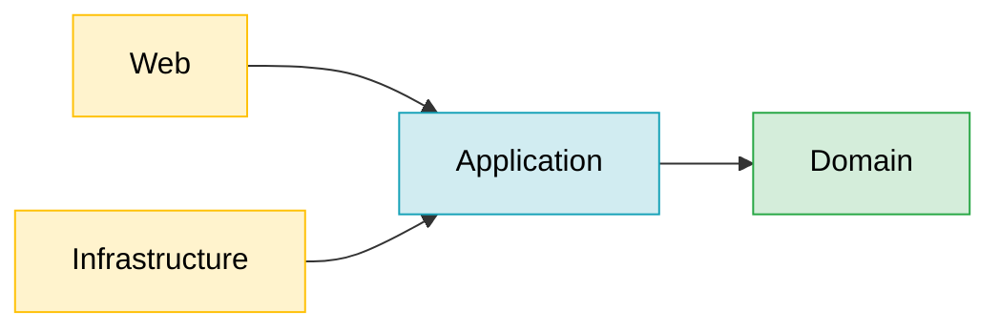
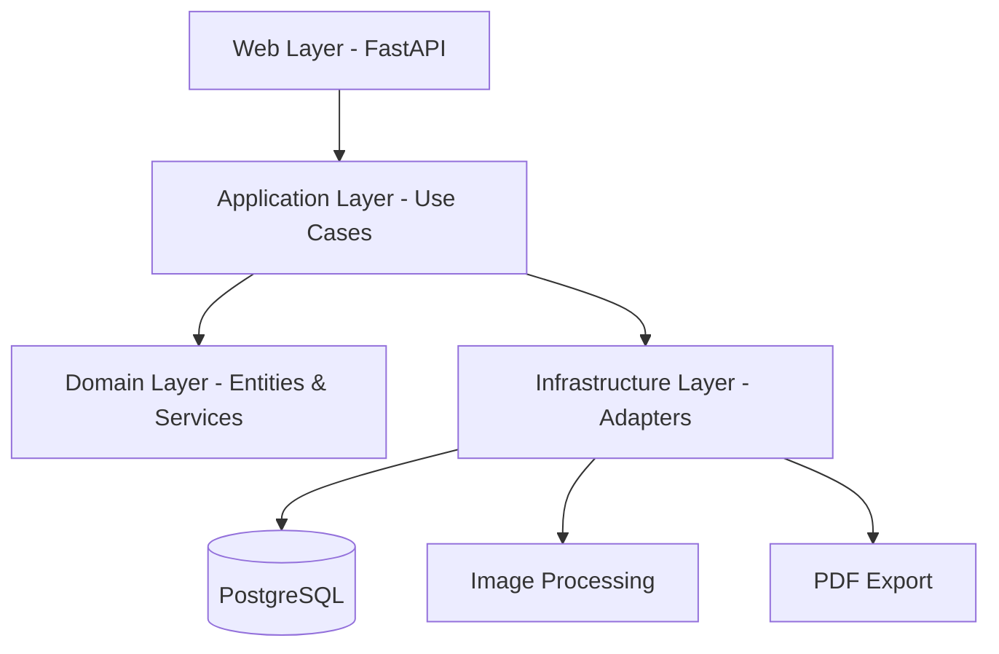

# Clean Architecture

## Dependency Rule

The fundamental constraint of Clean Architecture: **dependencies only point inward**.
The Domain layer has zero dependencies on any outer layer — it is pure Python.

```
┌─────────────────────────────────────────┐
│              Web  /  Infrastructure     │  ← depends on Application
│  ┌───────────────────────────────────┐  │
│  │           Application             │  │  ← depends on Domain
│  │  ┌─────────────────────────────┐  │  │
│  │  │          Domain             │  │  │  ← depends on NOTHING
│  │  │  (entities, services, ports)│  │  │
│  │  └─────────────────────────────┘  │  │
│  └───────────────────────────────────┘  │
└─────────────────────────────────────────┘
```

Arrows show allowed import directions:



**Domain never imports from Application, Infrastructure, or Web.**
Ports (interfaces) defined in Application allow Infrastructure to plug in without
the Domain knowing anything about databases, HTTP, or file systems.

---

## Runtime Data Flow

How a request travels through the layers at runtime:



---

## Layer Responsibilities

| Layer | Package | Responsibility |
|---|---|---|
| **Domain** | `app/domain/` | Business rules, entities, repository interfaces — framework-independent |
| **Application** | `app/application/` | Use cases, ports (Protocols), workflow orchestration |
| **Infrastructure** | `app/infrastructure/` | SQLAlchemy, Pillow, ReportLab, local file storage |
| **Web** | `app/web/` | FastAPI routes, HTMX partials, HTTP request/response |