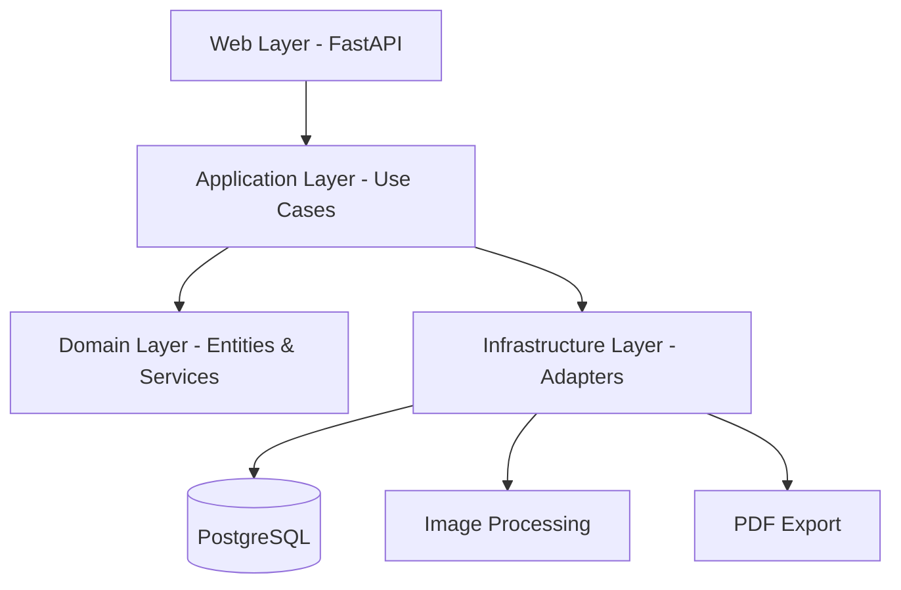

# Clean Architecture Diagram

This diagram shows the layered architecture of the Cross-Stitch Pattern Generator application.

## Layer Responsibilities

- **Web Layer**: FastAPI routes, request/response handling, HTTP concerns
- **Application Layer**: Use cases that orchestrate domain logic and infrastructure
- **Domain Layer**: Core business entities, services, and repository interfaces (framework-independent)
- **Infrastructure Layer**: Concrete implementations of external dependencies (database, file system, external APIs)